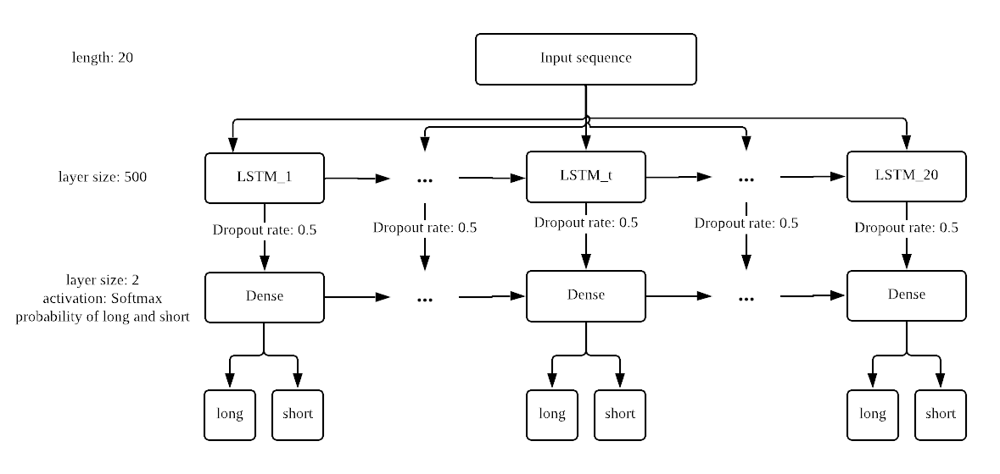
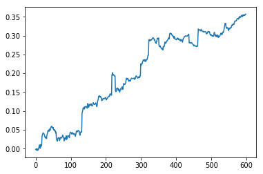
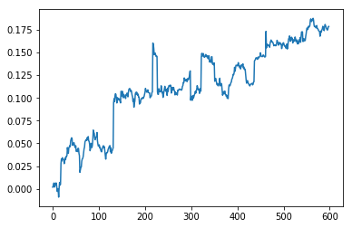

# Policy Gradient Trading Algorithm by Maximizing Sharpe Ratio

This is the sencod half of my capstone project and the first half can be seen [here](https://github.com/WANGXinyiLinda/Deep-Q-Learning-Bitcoin-Trading-Agent), which is a trading algorithm using deep Q learning. This project is the second half of my capstone project. In this project, I designed a trading algorithm using policy gradient to maximize the profit while incorporating the risk factor by directly maximizing the Sharpe ratio over a fixed period of time. Then I conduct experiments on a Bitcoin dataset to compare its performance with a Q learning algorithm. More details can be found in my [final report](SCIE4500_Final_Report.pdf) and in my final presentation [slides](SCIE4500_Final_presentation.pdf).

## Action space:

    {LONG=1, SHORT=-1}

## State:

I define the state variable  as a concatenation of the five-tuple discribing the current market  and the previous hidden state from LSTM . For more details, see section 2.2 in my final report.

## Policy network:

The policy network maps the curren state  to the policy  and . An illustration of the overall model structure is shown below.

## Usage:

For the proposed policy gradient algorithm, please see the jupyter notebook in the ./PG directory.

For the Q learning algorithm baseline, please see the jupyter notebook in the ./tabular-Q directory.

**NOTE**: this algorithm still has some robustness issues. To be solved latter.

## Test result:

Below are the cumulative profits by using the proposed policy gradient algorithm (left) and the Q learning algorithm (right) respectively.

